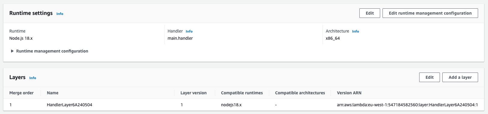
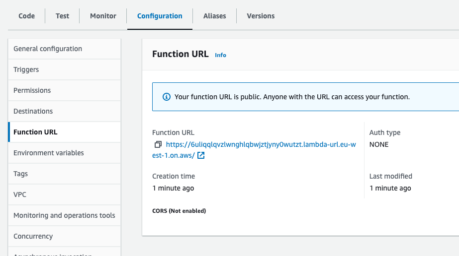

<!-- START doctoc generated TOC please keep comment here to allow auto update -->
<!-- DON'T EDIT THIS SECTION, INSTEAD RE-RUN doctoc TO UPDATE -->
**Table of Contents**  *generated with [DocToc](https://github.com/thlorenz/doctoc)*

- [Serverless](#serverless)
  - [Initializing Infrastructure](#initializing-infrastructure)
  - [Bootstrapping your AWS account](#bootstrapping-your-aws-account)
  - [Create an AWS Lambda Resource](#create-an-aws-lambda-resource)
  - [Bundling your NestJS App to Serverless](#bundling-your-nestjs-app-to-serverless)
  - [Running NestJS App in Serverless Offline](#running-nestjs-app-in-serverless-offline)
  - [Deploying Serverless NestJS App to AWS](#deploying-serverless-nestjs-app-to-aws)
  - [Making Lambda Function to Work](#making-lambda-function-to-work)

<!-- END doctoc generated TOC please keep comment here to allow auto update -->


## Serverless

### Initializing Infrastructure

Create a folder `infrastructure` and to that folder and execute the following commands to create an infrastructure project.

```bash
$ npm install -g aws-cdk
$ cdk init app --language typescript
```

Then the following files are created:

- `bin/infrastructure.ts` is the starting point of your infrastructure project where you will going to initialize your stack.
- `lib/infrastructure-stack.ts` contains the stack itself where you are going to declare the resources that you want in AWS.
- `test/infrastructure.test.ts` contains your unit tests for your infrastructure.

### Bootstrapping your AWS account

To be able to deploy your infrasture using `cdk deploy`, make sure to bootstrap your AWS environment.  Execute the following command.
```bash
$ cdk bootstrap aws://<your aws account id>/<your preferred region>
```

Make sure that you have exported a fresh copy of your administrator AWS ACCESS KEY ID and SECRET along with the SESSION TOKEN.  You only need to set this up once.

### Create an AWS Lambda Resource

In `lib/infrastructure-stack.ts` create an AWS Lambda resource by having the code inside the constructor.

```typescript
    const lambdaHandler = new Function(this, 'LambdaHandler', {
      code: Code.fromAsset(path.resolve(__dirname, '../../dist'), {
        exclude: ['node_modules'],
      }),
      handler: 'main.handler',
      runtime: Runtime.NODEJS_18_X,
      environment: {
        NODE_PATH: `$NODE_PATH:/opt`,
      },
    });
```

In `bin/infrastructure.ts`, instantiate the stack accordingly by having the following code.

```typescript
const ENVIRONMENT = {
  account: '<your AWS Account ID>',
  region: '<your preferred AWS region>',
};

const app = new cdk.App();
new InfrastructureStack(app, 'InfrastructureStack', {
  env: ENVIRONMENT,
});
```

Then execute `cdk synth` to generate files in `cdk.out`.  It should have the equivalent cloudformation template in json of your infrastructure. Also, make sure that you have exported a fresh copy of your AWS ACCESS KEY ID and SECRET along with the SESSION TOKEN.

Lastly, execute `cdk deploy` to deploy your infrastructure in AWS.

### Bundling your NestJS App to Serverless

Run the following command to install the necessary library for serverless to work into your NestJS App.

```bash
$ yarn add aws-lambda
$ yarn add @vendia/serverless-express
$ yarn add --dev @types/aws-lambda serverless-offline
```

Then update `main.ts` to declare the `handler` which will be the entry point for a serverless app.  Your `main.ts` will look like below.

```bash
import { NestFactory } from '@nestjs/core';
import { AppModule } from './app.module';
import { ValidationPipe } from '@nestjs/common';
import { Callback, Context, Handler } from 'aws-lambda';
import serverlessExpress from '@vendia/serverless-express';

let server: Handler;

async function bootstrap() {
    const app = await NestFactory.create(AppModule);
    app.useGlobalPipes(new ValidationPipe());

    await app.init();
    const expressApp = app.getHttpAdapter().getInstance();
    return serverlessExpress({ app: expressApp });
}

export const handler: Handler = async (
    event: any, 
    context: Context, 
    callback: Callback) => {
        context.callbackWaitsForEmptyEventLoop = false;
        server = server ?? await bootstrap();
        return server(event, context, callback);
};
```

Next, add a `webpack.config.js` with the following content.

```typescript
module.exports = (options, webpack) => {
    const lazyImports = [
        '@nestjs/microservices/microservices-module',
        '@nestjs/websockets/socket-module',
        '@as-integrations/fastify',
        '@apollo/subgraph',
        '@apollo/gateway',
        '@apollo/subgraph/package.json',
        '@apollo/subgraph/dist/directives',
        'class-transformer/storage',
        'ts-morph'
    ];

    return {
        ...options,
        externals: [
            { fsevents: "require('fsevents')" }
        ],
        output: {
            ...options.output,
            libraryTarget: 'commonjs2',
        },
        plugins:[
            ...options.plugins,
            new webpack.IgnorePlugin({
                checkResource(resource) {
                    if(lazyImports.includes(resource)) {
                        try {
                            require.resolve(resource);
                        } catch(err) {
                            return true;
                        }
                    }
                    return false;
                }
            }),
        ],
    };
};
```

Lastly, update `tsconfig.json` to include `"esModuleInterop": true` for the webpack to work properly.  Also, exclude the `infrastructure` directory when build is run by adding it in `tsconfig.build.json`.

To build your NestJS using webpack is to add an option `--webpack` in your `package.json` under `build` script.  Then execute `yarn run build`.

### Running NestJS App in Serverless Offline

You will need to have `serverless.yml` for your NestJS App to run serverless locally.  Create the `serverless.yml` and copy the content below to it.

```yml
service: serverless-example

plugins: 
  - serverless-offline

provider:
  name: aws
  runtime: nodejs14.x

functions:
  main:
    handler: dist/main.handler
    events:
      - http:
          method: ANY
          path: /
      - http:
          method: ANY
          path: '{proxy+}'
```

Then run `npx serverless offline` to run your NestJS App as serverless in your local machine. 

To be able to run the application using serverless offline with mock APIs, we will then need to modify `start:dev-with-mockApi` script.
Add a script in `package.json` for running the app using serverless offline including building the app.

```json
{
  "scripts": {
    ...
    "start:serverless-offline": "nest build --webpack && npx serverless offline",
    ...
  }
}
```

Then, modify the script `start:dev-with-mockApi` to make use of the newly added script `start:serverless-offline`.

```json
{
  "scripts": {
    ...
    "start:dev-with-mockApi": "npm-run-all copy:mock-api-json --parallel mockApi:start start:serverless-offline",
    ...
  }
}
```

Try to run `yarn run start:dev-with-mockApi`, it should be able to start ports `3000` and `4000`.

### Deploying Serverless NestJS App to AWS

We have already created an initial infrastructure for our AWS Lambda where it will get the build code from the `dist` 
folder of your NestJS App.  By default, NestJS will not include the dependencies into the `dist` and so we will need to 
add a `Handler Layer` of the Lambda function to contain the `node_modules` libraries.

In your `lib/infrastructure-stack.ts` add the following code to create a lambda layer.

```typescript
    const lambdaLayer = new LayerVersion(this, 'HandlerLayer', {
      code: Code.fromAsset(path.resolve(__dirname, '../../node_modules')),
      compatibleRuntimes: [Runtime.NODEJS_18_X],
      description: 'contains the production dependencies from node_modules of lambda function',
    });
```

Then add the newly created layer to your lambda handler.

```typescript
    const lambdaHandler = new Function(this, 'LambdaHandler', {
      ...
      layers: [lambdaLayer],
      ...
    });
```

> **_TAKE NOTE:_** There is a limited size that the lambda layer can support (unzipped deployment package size quota of 250 MB). 
So make sure that your `node_modules` only contains production dependencies.

Whenever we deploy the infrastructure, we need to take note of the following steps:

- Clean up your `node_modules` to make sure that it only contains the necessary dependencies for building your NestJS App
- Build the NestJS App with `--webpack` option
- Then, clean up again the `node_modules` folder to only contain production dependencies
- Afterwards, do a `cdk synth` and then `cdk deploy` to install your Serverless NestJS App to AWS Lambda

To be able to do these steps, we are going to introduce a new script in `package.json` in your main app folder. 
Add the following script:

```json
{
  "scripts": {
    ...
    "infra:deploy": "rm -frv node_modules && npm prune && nest build --webpack && npm prune --production && cd infrastructure && rm -frv cdk.out node_modules && npm install && cdk synth && cdk deploy"
  }
}
```

Try to run the newly added script by executing `yarn run infra:deploy`.  
Make sure to set in your environment for the necessary ACCESS TOKEN of your AWS Account.

Once your infrastructure is deployed, you should be able to see your Handler Layer in your AWS Lambda resource.



### Making Lambda Function to Work

By default, the lambda function configuration has 3 seconds timeout and 128 MB memory. 
The GraphQL application that we currently have takes more than 3 seconds for a request to work and that includes its `cold start`.
We will try to lessen the `cold start` by increasing the memory size as it will in turn increases the CPU.

In your `lib/infrastructure-stack.ts`, we will add the memory configuration of the Lambda Handler. 

```typescript
    const lambdaHandler = new Function(this, 'LambdaHandler', {
      ...
      memorySize: 512,
      ...
    });
```

Having a 512 MB memorySize, the time it took for a request with `cold start` is now at `~750ms` compared to `~3.04s`. 
And so, we can now proceed in configuring our GraphQL lambda function to work accordingly.

In the `dist` folder, there are still `**/*.d.ts` in which in return these are uploaded to the lambda resource. 
We will add this into our excluded files in the lambda handler.

```typescript
    const lambdaHandler = new Function(this, 'LambdaHandler', {
      code: Code.fromAsset(path.resolve(__dirname, '../../dist'), {
        exclude: ['node_modules', '**/*.d.ts'],
      }),
      ...
    });
```

Next is to make sure to set the `autoSchemaFile` configuration to `true` when it is in production mode. 
To be able to do this, change the configuration in `app.module.ts`.

```typescript
        GraphQLModule.forRoot<ApolloDriverConfig>({
            ...
            autoSchemaFile: process.env.NODE_ENV === 'development' ? 'schema.gql' : true,
            ...
        }),
```

This means that we will need to make sure to set the `NODE_ENV` to `development` whenever we run the app locally to generate `schema.gql`. 
Since we change the application to serverless, the only way to generate the schema is through the end-to-end test. 
And so, the following scripts in `package.json` needs to be updated.

```json
{
  "scripts": {
    ...
    "test:e2e-with-mockApi": "export NODE_ENV=development && npm-run-all copy:mock-api-json --parallel mockApi:start test:e2e --race",
    ...
  }
}
```

Try to run `yarn run test:e2e-with-mockApi`, it should still be able to create or update the `schema.gql` file.

Then, deploy your lambda function with the updates that you have by running `yarn run infra:deploy`, 
the lambda function should be able to generate all the necessary `*.js` and `*.js.map` files and deployed in your lambda resource.

Lastly, setup a function URL so that we can access the lambda function's GraphQL endpoint.  
To do this, add the following in `lib/infrastructure-stack.ts`.

```typescript
export class InfrastructureStack extends cdk.Stack {
  constructor(scope: Construct, id: string, props?: cdk.StackProps) {
    ...

    const lambdaHandler = new Function(this, 'LambdaHandler', {
      ...
    });

    lambdaHandler.addFunctionUrl({ authType: FunctionUrlAuthType.NONE });
  }
}
```

Deploy again your lambda function to AWS, a `Function URL` should exist at this point.



Then copy the provided function URL and access it to your browser, make sure to append `/graphql` to open the graphql playground. 
That's it! The GraphQL Lambda function is now up and running!
