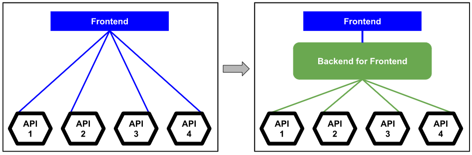
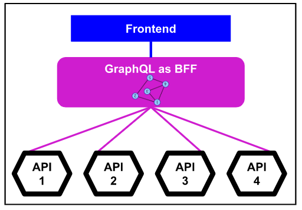
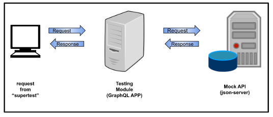

<!-- START doctoc generated TOC please keep comment here to allow auto update -->
<!-- DON'T EDIT THIS SECTION, INSTEAD RE-RUN doctoc TO UPDATE -->
**Table of Contents**  *generated with [DocToc](https://github.com/thlorenz/doctoc)*

- [Building GraphQL as BFF](#building-graphql-as-bff)
  - [Introduction](#introduction)
  - [What does the Architecture look like?](#what-does-the-architecture-look-like)
  - [Building schema](#building-schema)
  - [The Codebase](#the-codebase)
  - [Let’s Code](#lets-code)

<!-- END doctoc generated TOC please keep comment here to allow auto update -->

# Building GraphQL as BFF

## Introduction
One thing that fascinates me about **GraphQL** is that you have to design your objects into graphs. 
Unfortunately, working with GraphQL was never easy until you have the right tools, strategy, and setup.

Frontend on the other hand has demanding requirements.  
It requires different data that might not be within the domain just to please the user experience. 
That is why, the **Backend for Frontend** pattern emerges.

Why not use GraphQL as Backend for Frontend.  
With such data demand from frontend, we can maximize the graph representation in GraphQL.  
I just happened to find **Matt DeBergalis**, CTO of Apollo GraphQL, giving a speech about **Data Graph Architecture** and that is exactly what I came to realize.  
Frontend describes its data requirements while APIs/services describe their capabilities.  
In his talk, there is still more and you can check it out [here](https://youtu.be/EDqw-sGVq3k).

## What does the Architecture look like?
Imagine you have a system where the frontend connects to several APIs.  
With Backend for Frontend, there is only one interface that the frontend will communicate with.

Then, if we use GraphQL as BFF, the data we are going to provide to Frontend are in the **Data Graph**.

Before we dive into coding.  Let’s find out more about how we can best build up our GraphQL as a BFF application.

## Building schema
Contrast to creating an API following the API-first, we aim to produce a “perfect schema”.  
This is not a way to go with GraphQL.  
The best way is through **demand-driven** or **demand-oriented** schema.  
That means, we build the schema based on the client’s data requirements.  
Since we are using the GraphQL as BFF, we will then base it on the user experience data requirements.  
Schema evolves smoothly as there will be iterative requirements.

Since it will be demand-driven where we refer to the user experience data requirements, it would be best to follow the **Behavioral Driven Development (BDD)** practice.  
The test setup of your codebase does not need to be extravagant, tools that work with **Test Driven Development (TDD)** should be enough.  
The important thing is, the setup is an end-to-end testing.

Another thing to consider is the framework to use when building your GraphQL application.  
It should make your development experience easier.  
That is why **NestJS** is used in this codebase.  
There are 2 ways that NestJS offers in building the GraphQL application, schema-first and code-first.  
As a developer that is comfortable in coding classes, **code-first** would be a way to go.

## The Codebase
This codebase is already set up in such a way that we can follow the Test Driven or Behavioral Driven Development practice (see [TDD with BDD](https://github.com/fmsamson/graphql-as-bff/blob/master/docs/TDD_WITH_BDD.md)).  
It has a Mock API that will serve as the APIs that provides data for the frontend (see [Setting-up Mock API for development and testing](https://github.com/fmsamson/graphql-as-bff/blob/master/docs/SETUP_MOCK_API_FOR_DEV_AND_TEST.md)).  
It uses the Testing Module provided by NestJS to spin up the GraphQL application for testing and the “supertest” module that will act as the client that communicates to the GraphQL application (see [Setting-up the End-to-End Test](https://github.com/fmsamson/graphql-as-bff/blob/master/docs/SETUP_TESTING_MODULE.md)).  

Below is how the testing communication looks like.

## Let’s Code
TBD